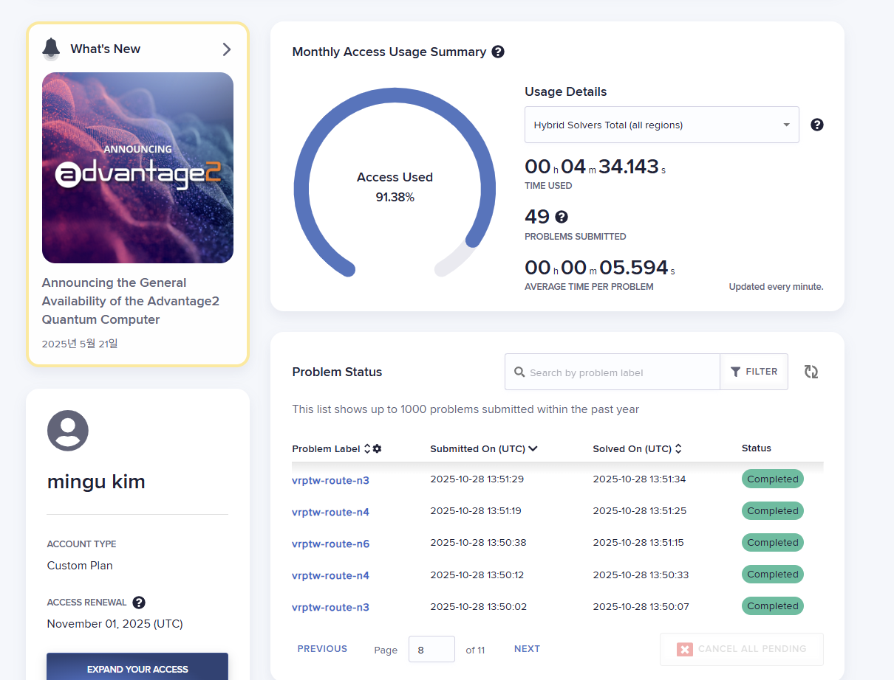
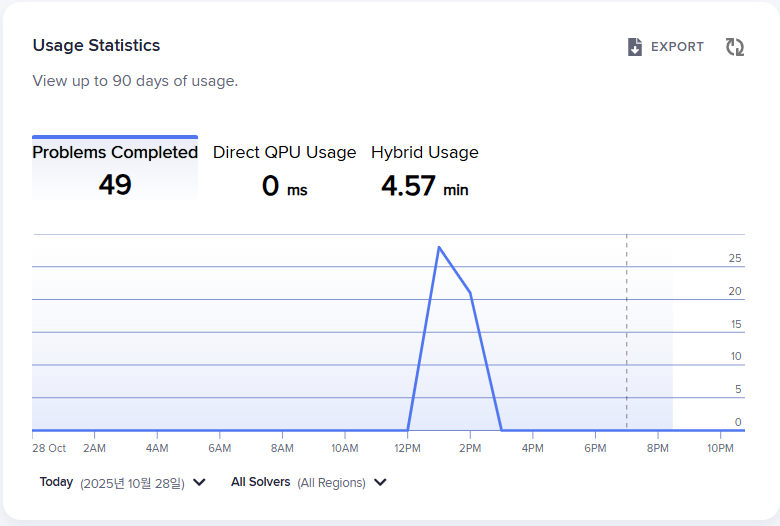
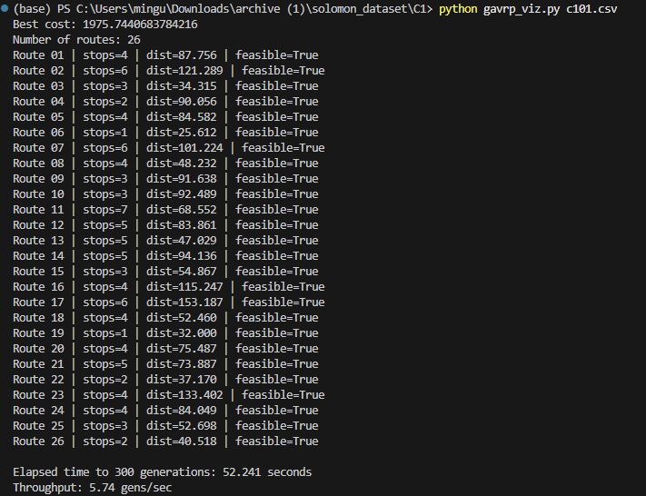
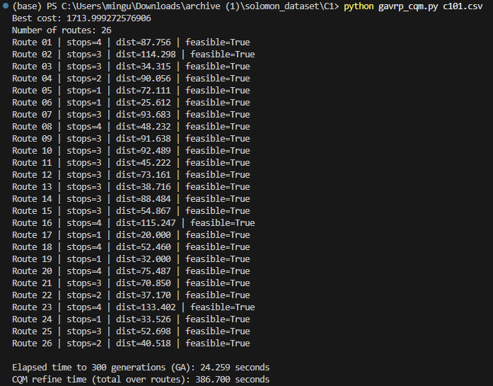
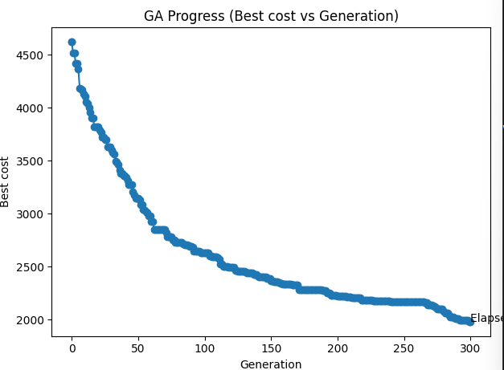
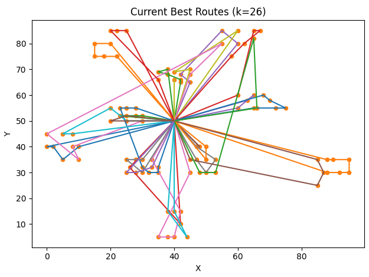

# GAVRP Project

차량 수요 배치 및 경로 계획 문제를 대상으로 한 최적화 알고리즘 구현 repository입니다.  
업로드된 Python 코드와 결과 시각화 이미지를 아래에서 확인할 수 있습니다.

---

## Code

| File | Description |
|---|---|
| [`gavrp.py`](./gavrp.py) | 기본 GAVRP 알고리즘 구현 파일입니다. |
| [`gavrp_qgm.py`](./gavrp_qgm.py) | QGM 기반 또는 개선 알고리즘 구현 파일입니다. |
| [`gavrp_viz.py`](./gavrp_viz.py) | 결과 시각화를 위한 Python 파일입니다. |

---

## Visualization Results

아래 이미지는 repository root에 업로드된 PNG 파일을 README에서 직접 표시한 것입니다.

<table>
  <tr>
    <td width="50%" align="center">
      
       Figure 1
    </td>
    <td width="50%" align="center">
      
       Figure 2
    </td>
  </tr>
  <tr>
    <td width="50%" align="center">
      
       Figure 3
    </td>
    <td width="50%" align="center">
      
       Figure 4
    </td>
  </tr>
  <tr>
    <td width="50%" align="center">
      
       Figure 5
    </td>
    <td width="50%" align="center">
      
       Figure 6
    </td>
  </tr>
</table>

---

## Notes

- 이미지 파일과 `README.md`가 같은 폴더에 있으므로 `./파일명.png` 형태의 상대 경로를 사용했습니다.
- GitHub에서는 파일명이 대소문자까지 정확히 일치해야 이미지가 정상적으로 표시됩니다.
- 이미지가 너무 크게 보이면 `width="100%"` 값을 `width="80%"` 또는 `width="600"`처럼 조정하면 됩니다.
